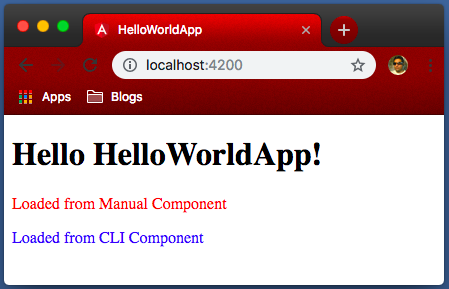

# Components; Angular's basic building blocks

Components are the core of an Angular application. Every angular application have at least one component. Every component generally have 4 files:

- TypeScript file (name.component.ts)
    - This is a Type Script class with `@Component` decorator. It defines data and logic for the component
- HTML file (name.component.html)
    - Although having this it is not mandatory as we can define HTML template in component decorator as well, but generally component HTML have multiple lines, which we mostly prefer to define in separate HTML file.
- Styles file (name.component.css)
    - It is style sheet for component's HTML. Like HTML, can can define CSS also in component decorator, but in most cases, to separate different type of code in different files, we mostly define styles in separate css file.
- Tests (name.component.spec.ts)
    - This file contains test cases for the component. We will discuss how to write unit tests for angular application but for most of the training, we will concentrate to understand different angular features. Thus, until we discuss about unit tests, we will not use this file in any component.

## Creating a component

There are two ways to create new components:

1. Manually
2. Using Angular CLI

Let's check both of them one by one.

### Creating a component manually.

We already discussed that a component generally have 3 files; TypeScript class, HTML Template and CSS styles.

In out HelloWorldApp, lets create a new component to display 'Manual compoent'.

As we discussed in `Section 2.4 How our application works?`, a module bootstraps only one component and we already bootstraped 'AppComponent'. All other components, now should be called or loaded from AppComponent.

> Separate folder for each component: A complex angular application contains many components. Thus, as good a good coding practice, we should create separate folder for each component and they should follow hirarchical order. For example, if app component is going to load 'ManualComponent', it must be in 'app/manual' folder.

For this example, we are going to name our new componene as `ManualComponent`. Following coding best practices of angular, lets create folder `manual` in `app` folder. Then we need to create 3 files

**src/app/manual/manual.component.ts**

```typescript
import { Component } from '@angular/core';

@Component({
  selector: 'app-manual',
  templateUrl: './manual.component.html',
  styleUrls: ['./manual.component.css']
})
export class ManualComponent { }
```

As we discussed, Type Script is super set of Java Script. Like Java Script, if we include a TS file into another TS file, included TS file needs to export something. Thus, on line 8, we are exporting a class named `ManualComponent`. However, we need not to code anything right now so this class is empty.

From angular's point of view, to make this file as component, we need to define component decorator. Component is something provided by Angular, not Type Script. Thus, in first line, we are importing Component from angular core library. Once imported, we can use `@Component()` decorator on 'ManualComponent' class to tell angular this is a component.

A Component decorator needs three things (as JS object)

- selector
    - It tells angular how other components will refer this component. In other words, it define the tag which we can use in HTML. To avoid confusion with other HTML tags, as a coding best practice, we prefix our custom tags with something, mostly with `app-`. Thus, out selector is `app-manual`. However, you are free to choose any name, provided it is unique.
- templateUrl
    - It defines the template (HTML) for the component. As discussed earlier, in case we just have one or two line HTML, we can also define HTML directly here. In that case, we define template, instead of templateUrl. However, either 'template' or 'templateUrl' is mandatory.
- styleUrls
    - Please note, we have only one template but can have multiple style files for a component. Thus, it is styleUrls (Notice 's' at the end). Also, unlike template, it is and array, not string.
    - Like templateUrl, we can also replace styleUrls with styles. Any one of them is mandatory.

Lets also define manual.component.html, which is ideally just one line of code

```html
<p>Loaded from Manual Component</p>
```

Similarly, manual.component.css is also very simple style sheet

```css
p {
  color: red;
}
```

We defined the component but we are still not using it anywhere. Lets use our new tag in app.component.html

```html
<h1>
  Hello {{ title }}!
</h1>
<app-manual></app-manual>
```

Although it seems we are done, we have one final step remaining. Angular still do not know about our new component and will throw an errer as soon as it comes across `app-manual` tag in app component's html. To tell angular about our new component, we must update `app.module.ts` file.

```typescript
import { BrowserModule } from '@angular/platform-browser';
import { NgModule } from '@angular/core';

import { AppComponent } from './app.component';
import { ManualComponent } from './manual/manual.component';

@NgModule({
  declarations: [
    AppComponent,
    ManualComponent
  ],
  imports: [
    BrowserModule
  ],
  providers: [],
  bootstrap: [AppComponent]
})
export class AppModule { }
```

Here, we added line 5, where we are importing our new component. Still, just importing a Type Script file will not work. In line 10, we are actually declaring our new component. Declaration means, angular will not immediately load this new component but will read its component decorator and will know about new tag. As soon as we use new tag in any component (app.component.html in our case), angular will load (create instance of ManualCompoent) our component there.

With this, our application now loads our new component


### Creating a component using Angular CLI.

It is good to understand how angular components works. However, once we understand it, instead of creating components manually, we can use angular CLI to actually create our components. This will  fast track component creation, as single command can create all the required files as well as make necessary changes in module.ts file.

> Angular CLI starts with `ng` command. We already saw `ng new` and `ng serve` commands. They both were Angular CLI commands.

Command to generare new component is `ng generate component <name>`. Angular CLI also comes with lot of short-cut command. Short cut command to generate component is `ng g c <name>`. Let's run `ng generate component cli` command to create new component 'CliComponent' through Angular CLI.

```bash
ng generate component cli
CREATE src/app/cli/cli.component.css (0 bytes)
CREATE src/app/cli/cli.component.html (22 bytes)
CREATE src/app/cli/cli.component.spec.ts (607 bytes)
CREATE src/app/cli/cli.component.ts (257 bytes)
UPDATE src/app/app.module.ts (466 bytes)
```

As we can see in output, it generated 4 files and updated app.module.ts file. Let's also update 'cli.component.html' and 'cli.component.css' to match our manual component style.

**cli.component.html**

```html
<p>Loaded from CLI Component</p>
```

**cli.component.css**

```css
p {
  color: blue;
}
```

We also need to add our selector 'app-cli' (auto generated, check in ts file) in 'app.component.html'

**app.component.css**

```html
<h1>
  Hello {{ title }}!
</h1>
<app-manual></app-manual>
<app-cli></app-cli>
```

Now our generated output is as follow



## Component stylesheet

In above image, we can see manual component is in red and cli component is in blue, exactly as we defined in our css.

However, if you were checking closely, you might be wondering that both components have `<p>` tag, then how angular manage to define separate styles for single tag. To understand this, lets use chrome's dev tools to check generated HTML code as shown in following image.


As you might notice, `app-root` tag have a special attribute `_nghost-c0` and all the elements within it, including `app-manual` and `all-cli`, have attribute `_ngcontent-c0`. Here, `c0` is the name angular provided to `app-root`.

Similarly, `app-manual` and `app-cli` have attributes `_nghost-c1` and `nghost-c2` and all element within them (only 'p' tag) have attributes `_ngcontent-c1` and `_ngcontent-c2` respectively. Thus, angular provided them name as `c1` and `c2`.

This way, angular may identify different components. In the same image, 'p' tag under `app-manual` is selected and its styles are loaded on right hand side. Please note, angular have not generated generic style for `p` tag but for `p[_ngcontent-c1]` tag. In this way, angular makes sure the style we defined for an individual components, affets only that component. We will later learn how to define generic style that may be applied to all elements, regardless of component.
