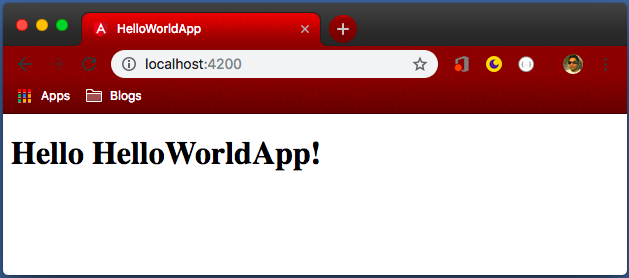

# Install & First Application

## Node JS

As a prerequisite, Angular need Node JS. An Angular application does not depends on Node JS but while development, development tools of angular like CLI, Development Server, installing dependencies etc take advantage of tools provided by Node JS. Node JS can be downloaded from [`Official Website`](https://nodejs.org/en/)[^2.1]. It is recommended to the install latest version, not LTS version on Node JS.

[^2.1]: https://nodejs.org/en/

It is recommended to install Node JS using [`Node Version Manager (NVM)`](https://github.com/creationix/nvm)[^2.2]. Angular works best with Latest version. However, if you are a Node JS developer, or depends on Node JS for other tasks, you might want to stay with the LTS version. NVM, not only allow us to install multiple Node JS versions but also it is very easy to switch versions of Node JS with NVM.

[^2.2]: https://github.com/creationix/nvm

Installing Node JS directly or through NVM is straightforward. Please google the latest information on installing Node JS.

## Angular CLI

Angular CLI makes it very easy to work with Angular. We mostly develop Angular Applications in [`Type Script`](https://www.typescriptlang.org)[^2.3], which is the superset of JavaScript. Don't worry about it, TypeScript will covered be during the Corporate Training Meet-up. TypeScript needs to be compiled to JavaScript. Also, we have a lot of dependencies for the project development and a local server to test the application. Angular CLI manages all that and makes developer's life very easy.

[^2.3]: Type Script: https://www.typescriptlang.org

We can install Angular CLI globally with the following command

```bash
npm install -g @angular/cli
```

## First Angular Application

Angular CLI, installed above, can be used with `ng` command. Run the following command

```bash
ng new HelloWorldApp
```

The command will create a new folder `HelloWorldApp` with an angular project. To run the local server, go to the new project folder and the run command

```bash
ng serve
```

After that, open `localhost:4200` in the browser to check default application.

### Directory Sctucture

At the root level, in the project, you will find 3 folders

- e2e
    - This folder stands for `End to End` testing and contains test cases. We will learn how to test later.
- node_modules
    - This folder is created by npm (Node Package Manager) and contains all the dependencies of the project.
- src
    - This is the folder which the contains source code of our project and while developing an angular application, we will be mostly working within this folder.
    - This folder also contains few files and folder. We will be mostly using `app` folder and know about other files and folder as and when needed while we advance with angular learning. For now, just do not touch any other file/folder.

Other than these 3 folders, you will find a few files as well at the root level. They are mostly supporting files to configure our new Angular project.

### Changing output for First Application

Let's delete everything in `app/app.component.html` and put simple code like

**app/app.component.html**

```html
<h1>
  Hello {{ title }}!
</h1>
```

The output will be as follow



We can see `{{ title }}` has been replaced by `HelloWorldApp`. This is done in `app.component.ts` file.

**app.component.ts**

```typescript
import { Component } from '@angular/core';

@Component({
  selector: 'app-root',
  templateUrl: './app.component.html',
  styleUrls: ['./app.component.css']
})
export class AppComponent {
  title = 'HelloWorldApp';
}
```

Notice line 9 `title = 'HelloWorldApp';`. This is actually where we are assigning a value to the variable `title`, which is later used in `app.component.html` file. This is actually called ___String Interpolation___. Thus, if there is a variable in TypeScript class, we can display it in HTML with String Interpolation like `{{ variableName }}`. We will learn more about it in 'Data Binding' section of the next chapter 'Understanding component; The basic building block of Angular'.

## How our application works?

We saw we can update 'app.component.html' to update the design and 'app.component.ts' to change the variable, but how are they working?

To understand it in a better way, let's check the source code of the application in the browser (Right click and select 'view source' in chrome). It is like

```html
<!doctype html>
<html lang="en">
<head>
  <meta charset="utf-8">
  <title>HelloWorldApp</title>
  <base href="/">

  <meta name="viewport" content="width=device-width, initial-scale=1">
  <link rel="icon" type="image/x-icon" href="favicon.ico">
</head>
<body>
  <app-root></app-root>
<script type="text/javascript" src="runtime.js"></script><script type="text/javascript" src="polyfills.js"></script><script type="text/javascript" src="styles.js"></script><script type="text/javascript" src="vendor.js"></script><script type="text/javascript" src="main.js"></script></body>
</html>
```

What!! Our code from 'app.component.html' (`<H1>` tag) or 'app.component.ts' (`title` variable) is not there. How it is working then?

We write angular code in TypeScript, which is a superset of JavaScript but the browser does not understands TypeScript. Thus, to display the page, angular needs to compile our application into Java Script.

Notice Line 13, here we are including few JavaScript files

- runtime.js
- polyfills.js
- styles.js
- vendor.js
- main.js

We didn't write any of these JS files. They are actually dependencies of Angular application and in this simple Hello World Application, main.js contains our actual source code. We can also notice line 12 `<app-root></app-root>`, which is updated by generated JS files to display out contents. However, let's not try to understand generated JavaScript; Angular CLI makes sure that generated JS files are optimized but not very convenient to read by humans. Instead, let's concentrate on how Angular CLI read our application to generate these JS files.

When we run `ng serve` (or `ng build`, as we will see later), Angular CLI first looks `angular.json` file to check the configurations. These configurations are well set and mostly we need not touch them. From it, it identifies the main TypeScript file is `src/main.ts` as follow:

```typescript
import { enableProdMode } from '@angular/core';
import { platformBrowserDynamic } from '@angular/platform-browser-dynamic';

import { AppModule } from './app/app.module';
import { environment } from './environments/environment';

if (environment.production) {
  enableProdMode();
}

platformBrowserDynamic().bootstrapModule(AppModule)
  .catch(err => console.error(err));
```

Here, the first few lines are `import`. It is a TypeScript feature which includes other files in the program. After them, it sets environment (development, testing, staging, production, or as you wish). Then at line 11, `bootstrapModule` inform Angular CLI that `AppModule` is the first module to be initialized and actually is the starting point of our application. All files of `XyzModule` are stored in folder `src/xyz`. Thus, files of AppModule are stored in folder `src/app`.

To load App module, Angular CLI will first check `src/app/app.module.ts` file, which, by default, looks as follow

```typescript
import { BrowserModule } from '@angular/platform-browser';
import { NgModule } from '@angular/core';

import { AppComponent } from './app.component';

@NgModule({
  declarations: [
    AppComponent
  ],
  imports: [
    BrowserModule
  ],
  providers: [],
  bootstrap: [AppComponent]
})
export class AppModule { }
```

Here we get the first important lesson about angular, TypeScript part of this file contains import statements (first four line) and an empty class (last line).

Line 6-15 looks like doc-block or metadata about the class. In Angular, it is called decorator. Module Decorator, to be exactly as it starts with `@NgModule`, which is imported from angular core library in line 2. It takes a JavaScript object as an argument. This JavaScript object contains few important properties, most important here is `bootstrap` (line 14). This tells Angular CLI which component should be loaded first. For now, our application contains just one module and one component but as we start making complex applications, we will have multiple modules and each module will contain several components.

Now angular knows it needs to start with AppComponent, it will further check `app.component.ts` file.

```typescript
import { Component } from '@angular/core';

@Component({
  selector: 'app-root',
  templateUrl: './app.component.html',
  styleUrls: ['./app.component.css']
})
export class AppComponent {
  title = 'HelloWorldApp';
}
```

Here, we can find Component Decorator. Most important to note is `selector`, which is `app-root`. If you remember, we saw `<app-root></app-root>` on line 11 of generated HTML. It tells angular, it needs to replace `app-root` tag with `app component` and code of `app.component.html` will replace `app-root` on the browser through generated javascript.

This is just a high-level view of how angular applications work. We are not ready to learn more about components, which are basic building blocks of an angular application.
