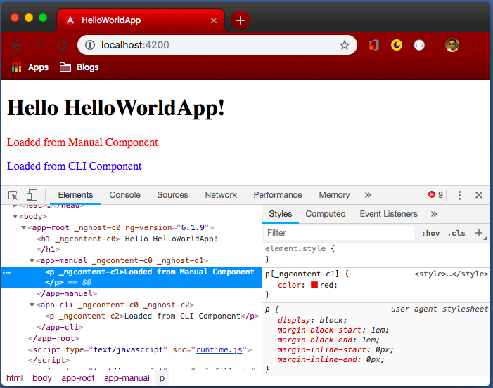
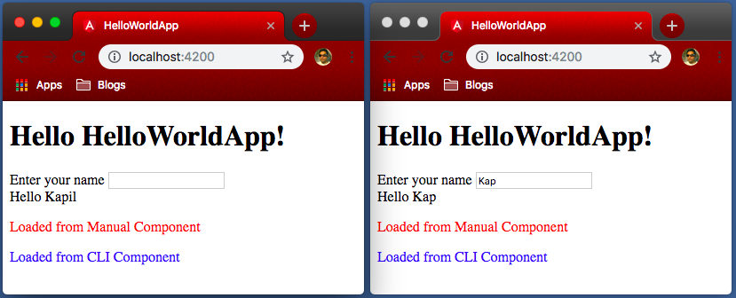
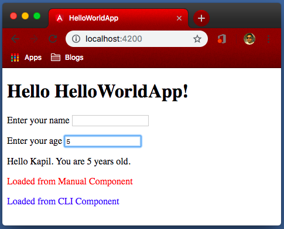

# Components; Angular's basic building blocks

Components are the core of an Angular application. Every angular application has at least one component. Every component generally has 4 files:

- TypeScript file (name.component.ts)
    - This is a TypeScript class with `@Component` decorator. It defines data and logic for the component
- HTML file (name.component.html)
    - Although having this it is not mandatory as we can define HTML template in component decorator as well, but generally, component HTML have multiple lines, which we mostly prefer to define in a separate HTML file.
- Styles file (name.component.css)
    - It is style sheet for component's HTML. Like HTML, we can define CSS also in the component decorator, but in most cases, to separate different type of code in different files, we mostly define styles in a separate CSS file.
- Tests (name.component.spec.ts)
    - This file contains test cases for the component. We will discuss how to write unit tests for angular application but for most of the training, we will concentrate to understand different angular features. Thus, until we discuss unit tests, we will not use this file in any component.

## Creating a component

There are two ways to create new components:

1. Manually
2. Using Angular CLI

Let's check both of them one by one.

### Creating a component manually.

We already discussed that a component generally has 3 files; TypeScript class, HTML Template and CSS styles.

In out HelloWorldApp, let's create a new component to display 'Manual component'.

As we discussed in `Section 2.4 How our application works?`, a module bootstraps only one component and we already bootstrapped 'AppComponent'. All other components now should be called or loaded from AppComponent.

> Separate folder for each component: A complex angular application contains many components. Thus, as a good coding practice, we should create a separate folder for each component and they should follow a hierarchical order. For example, if the app component is going to load 'ManualComponent', it must be in 'app/manual' folder.

For this example, we are going to name our new component as `ManualComponent`. Following coding best practices of angular, let's create folder `manual` in `app` folder. Then we need to create 3 files

**app/manual/manual.component.ts**

```typescript
import { Component } from '@angular/core';

@Component({
  selector: 'app-manual',
  templateUrl: './manual.component.html',
  styleUrls: ['./manual.component.css']
})
export class ManualComponent { }
```

As we discussed, TypeScript is the superset of JavaScript. Like JavaScript, if we include a TS file into another TS file, included TS file needs to export something. Thus, on line 8, we are exporting a class named `ManualComponent`. However, we need not code anything right now so this class is empty.

From angular's point of view, to make this file as a component, we need to define component decorator. A component is something provided by Angular, not TypeScript. Thus, in the first line, we are importing Component from angular core library. Once imported, we can use `@Component()` decorator on 'ManualComponent' class to tell angular this is a component.

A Component decorator needs three things (as JS object)

- selector
    - It tells angular how other components will refer to this component. In other words, it defines the tag which we can use in HTML. To avoid confusion with other HTML tags, as a coding best practice, we prefix our custom tags with something, mostly with `app-`. Thus, out selector is `app-manual`. However, you are free to choose any name, provided it is unique.
- templateUrl
    - It defines the template (HTML) for the component. As discussed earlier, in case we just have one or two line HTML, we can also define HTML directly here. In that case, we define the template, instead of templateUrl. However, either 'template' or 'templateUrl' is mandatory.
- styleUrls
    - Please note, we have only one template but can have multiple style files for a component. Thus, it is styleUrls (Notice 's' at the end). Also, unlike template, it is an array, not a string.
    - Like templateUrl, we can also replace styleUrls with styles. Anyone of them is mandatory.

Let's also define manual.component.html, which is ideally just one line of code

**app/manual/manual.component.html**

```html
<p>Loaded from Manual Component</p>
```

Similarly, manual.component.css is also a very simple style sheet

**app/manual/manual.component.css**

```css
p {
  color: red;
}
```

We defined the component but we are still not using it anywhere. Let's use our new tag in app.component.html.

**app/app.component.html**

```html
<h1>
  Hello {{ title }}!
</h1>
<app-manual></app-manual>
```

Although it seems we are done, we have one final step remaining. Angular still does not know about our new component and will throw an error as soon as it comes across `app-manual` tag in the app component's HTML. To tell angular about our new component, we must update `app.module.ts` file.

**app/app/module.ts**

```typescript
import { BrowserModule } from '@angular/platform-browser';
import { NgModule } from '@angular/core';

import { AppComponent } from './app.component';
import { ManualComponent } from './manual/manual.component';

@NgModule({
  declarations: [
    AppComponent,
    ManualComponent
  ],
  imports: [
    BrowserModule
  ],
  providers: [],
  bootstrap: [AppComponent]
})
export class AppModule { }
```

Here, we added line 5, where we are importing our new component. Still, just importing a TypeScript file will not work. In line 10, we are actually declaring our new component. The declaration means, angular will not immediately load this new component but will read its component decorator and will know about new tag. As soon as we use the new tag in any component (app.component.html in our case), angular will load (create an instance of ManualCompoent) our component there.

With this, our application now loads our new component


### Creating a component using Angular CLI.

It is good to understand how angular components work. However, once we understand it, instead of creating components manually, we can use angular CLI to actually create our components. This will fast track component creation, as a single command can create all the required files as well as make necessary changes in the module.ts file.

> Angular CLI starts with `ng` command. We already saw `ng new` and `ng serve` commands. They both were Angular CLI commands.

The command to a generate new component is `ng generate component <name>`. Angular CLI also comes with a lot of short-cut command. The shortcut command to generate component is `ng g c <name>`. Let's run `ng generate component cli` command to create new component 'CliComponent' through Angular CLI.

**Bash/CLI/console**

```bash
ng generate component cli
CREATE src/app/cli/cli.component.css (0 bytes)
CREATE src/app/cli/cli.component.html (22 bytes)
CREATE src/app/cli/cli.component.spec.ts (607 bytes)
CREATE src/app/cli/cli.component.ts (257 bytes)
UPDATE src/app/app.module.ts (466 bytes)
```

As we can see in the output, it generated 4 files and updated app.module.ts file. Let's also update 'cli.component.html' and 'cli.component.css' to match our manual component style.

**app/cli/cli.component.html**

```html
<p>Loaded from CLI Component</p>
```

**app/cli/cli.component.css**

```css
p {
  color: blue;
}
```

We also need to add our selector 'app-cli' (auto-generated, check in TS file) in 'app.component.html'

**app/app.component.css**

```html
<h1>
  Hello {{ title }}!
</h1>
<app-manual></app-manual>
<app-cli></app-cli>
```

Now our generated output is as follow


## Component stylesheet

In the above image, we can see manual component is in red and CLI component is in blue, exactly as we defined in our CSS.

However, if you were checking closely, you might be wondering that both components have `<p>` tag, then how angular manage to define separate styles for a single tag. To understand this, let's use chrome's dev tools to check generated HTML code as shown in the following image.



As you might notice, `app-root` tag have a special attribute `_nghost-c0` and all the elements within it, including `app-manual` and `all-cli`, have attribute `_ngcontent-c0`. Here, `c0` is the name angular provided to `app-root`.

Similarly, `app-manual` and `app-cli` have attributes `_nghost-c1` and `nghost-c2` respectively and all element within them (only 'p' tag) have attributes `_ngcontent-c1` and `_ngcontent-c2` respectively. Thus, angular provided them name as `c1` and `c2`.

This way, angular may identify different components. In the same image, 'p' tag under `app-manual` is selected and its styles are loaded on the right-hand side. Please note, angular have not generated generic style for `p` tag but for `p[_ngcontent-c1]` tag. In this way, angular make sure the style we defined for individual components, affects only that component. We will later learn how to define a generic style that may be applied to all elements, regardless of component.

## Data Binding

Data binding is a way of communication between TypeScript (Business Logic) and HTML Template (Presentation). There are four types of data binding in Angular.

|   | Data Binding         | Syntax                     | Direction   |
|---|----------------------|----------------------------|-------------|
| 1 | String Interpolation | {{ variableName }}         | TS -> HTML  |
| 2 | Property Binding     | [property]="data"          | TS -> HTML  |
| 3 | Event Binding        | (event)="expression"       | HTML -> TS  |
| 4 | Two-way Binding      | [(ngModel)]="variableName" | HMTL <-> TS |

### String interpolation

We already saw the example of string interpolation. We defined variable `title` in `app.component.ts` of our HelloWorldApp. Later, we displayed it in `app.component.html` using string interpolation `{{ title }}`.

As we can print variable in TS file to HTML file, in string interpolation, data flows from TypeScript to HTML.

### Property Binding

Like String Interpolation, data flows from TypeScript to HTML for Property Binding as well. However, here property means some HTML property like an image's src property, button's disabled property, etc. Thus, if we want to show the value of some variable on the HMTL page, use string interpolation. However, if you want to control property (or attribute) of some HTML element, Property binding is used.

> For both 'String Interpolation' and 'Property Binding' data flows from TypeScript to HTML.
> 
> String Interpolation: Display value of TS variable on DOM
> 
> Property Binding: Assign the value of TS variable to HTML property

For example, let's set a new variable `name` in our app.component.ts.

**app.component.ts**

```typescript
import { Component } from '@angular/core';

@Component({
  selector: 'app-root',
  templateUrl: './app.component.html',
  styleUrls: ['./app.component.css']
})
export class AppComponent {
  title = 'HelloWorldApp';
  name = 'Kapil';
}
```

Now with `name` set, let's display it in HTML, but with property binding.

**app.component.html**

```html
<h1>
  Hello {{ title }}!
</h1>
<div>
  <span>Hello </span>
  <span [innerHtml]="name"></span>
</div>

<app-manual></app-manual>
<app-cli></app-cli>
```

In line 5, we could although use String Interpolation like `<span>{{ name }}</span>`, we used Property Binding to show the concept.

In the above example, both String Interpolation and Property Binding could be used, we can select any one based on our requirements.

> To understand the properties and events of HTML, [MDN (Mozilla Developer Network) Web Docs](https://developer.mozilla.org/en-US/)[^3.1] is one of the best resources. Google is also a developer's best friend. As an Angular developer, you need to manipulate HTML DOM a lot, thus understanding DOM, HTML elements and their properties and events is necessary. It is like vocabulary for Frontend developer. However, if you do not understand them right now, don't worry, understanding them is easy and with time and experience, you will be comfortable. Just keep increasing your vocabulary.

[^3.1]: https://developer.mozilla.org/en-US/

### Event Binding

DOM regularly fire events based on user activity/input. Some example of events are:

- A user moves the mouse.
- Mouse enters/leaves an element (hover).
- Mouse (left/right/wheel) clicked.
- Key is pressed/down/up

As a front-end developer, we need to react to these events and this is where event binding is useful. As you can assume, user activity (event) happens on HTML (contents visible to the user) but the code to react on these events is business logic, which is written in TypeScript. Thus, event binding sends data from HMTL to TypeScript.

For example of Event Binding, let's add an input box on our app component. Whenever the user enters something there, default name 'Kapil' should change to the name entered by the user.

**app/app.component.html**

```html
<h1>
  Hello {{ title }}!
</h1>
Enter your name <input type="text" (input)="onChange($event)" />
<div>
  <span>Hello </span>
  <span [innerHtml]="name"></span>
</div>

<app-manual></app-manual>
<app-cli></app-cli>
```

As you can notice on line 4, there is a input of type text. However, it also have `(input)="onChange($event)"`. This is event binding. One event on [`input type=text`](https://developer.mozilla.org/en-US/docs/Web/HTML/Element/input/text)[^3.2] tag is [`input`](https://developer.mozilla.org/en-US/docs/Web/Events/input)[^3.3].

[^3.2]: https://developer.mozilla.org/en-US/docs/Web/HTML/Element/input/text
[^3.3]: https://developer.mozilla.org/en-US/docs/Web/Events/input

We are binding input event. While binding an event, we need to tell Angular what to do when this event is fired. We want to call a function `onChange` and we also want to pass event data. Event data can be passed with a special reserved variable `$event`. Angular creates that variable whenever an event happens. Now, we can handle this event on TypeScript as follow.

**app/app.component.ts**

```typescript
import { Component } from '@angular/core';

@Component({
  selector: 'app-root',
  templateUrl: './app.component.html',
  styleUrls: ['./app.component.css']
})
export class AppComponent {
  title = 'HelloWorldApp';
  name = 'Kapil';

  onChange(event: KeyboardEvent) {
    this.name = (<HTMLInputElement>event.target).value;
  }
}
```

We added `onChange` function in TypeScript between line 12-14.

> Few notes about TypeScript and TypeScript functions:
> 
> - TypeScript allows to define types of variable, that is, unlike JavaScript, it can act as 'strictly typed language'. That's how it got its name.
> - To define the type of a variable, the syntax is `variableName: type`.
> - In TypeScript, we can define functions by writing function name, followed by () for optional parameters and {} for function body.
> - TypeScript can also define the return type.
> - Complete Syntax:
> 
> ```typescript
> functionName(parameterOne: Type, parameterTwo: type): returnType { 
>   // function body;
> }
> ```
>
> - If we need to refer any variable or other function defined in the class, we can do this using `this.` keyword. This should be clear if you worked with any object-oriented programming language. Unfortunately, OOPs is out of scope for this course. (PS: I'm planning OOP video as well. Keep checking my [YouTube channel](http://bit.ly/kapilyoutube)[^3.4]; Sorry for self-promotion but couldn't resist ;)

[^3.4]: http://bit.ly/kapilyoutube

`onChange` function is one line function, which is crystal clear, we are assigning the value of our input tag to the variable 'name'. However, looking at syntax, you may have following questions:

- How can I know the event is of type 'KeyboardEvent'?
- What is HTMLInputElement?
- What is (<HTMLInputElement>event.target)?
- From where should I learn all these alien-looking syntaxes?

Valid questions, especially if you didn't have much experience with JavaScript. You will learn all of them with time and experience but I have few suggestions here, which could help you to self-identify things.

Let's replace `onChange` function as follow and check the output in console (select developer tools in chrome and open `console` tab)

```typescript
onChange(event: Event) {
    console.log(event.constructor.name);
    console.log(event.target.constructor.name);
    console.log((<HTMLInputElement>event.target).value);
    this.name = (<HTMLInputElement>event.target).value;
}
```

Here, we added 3 `console.log` statements. It is javascript syntax to log some value through JS. These logs can be seen in the console of the browser. Console output should be like (Assuming you pressed 'K'):

```bash
InputEvent
HTMLInputElement
K
```

If you have an object in javascript, you can get its class name by adding '`.constructor.name`' to the object. Thus, the first log will tell us the name of the class of `event`, which is InputEvent, you can use it to write the type of parameter.

Now (missing in code) you can do `console.log(event)` to inspect different properties of 'event' object. You will notice, it has a property 'target' which is again an object. When you extract 'target' you will find data entered in text box against `value` property.

Still, `this.name = event.target.value;` will not work. You will get error 'value is not property of InputElement'. Here, second console statement `console.log(event.target.constructor.name);` will help you. It will tell us `event.target` is an object of `HTMLInputElement` class but our error mentioned 'InputElement'. Thus, we specifically need to tell Angular that `event.target` is an object of `HTMLInputElement`.

We can cast (change) object by syntax `<castTo>object`. Thus, `<HTMLInputElement>event.target` will convert `target` to object of `HTMLInputElement`. Please note () for this whole syntax as we want to call `value` on casted object. Now `(<HTMLInputElement>event.target).value` must not looked like alien code and you should be able to solve similar problem in future.

Once you solve the problem, don't forget to remove `console.log` statements.

Now with these changes, our application looks as follow:



Here, the left image shows the default value of the name and teh right image shows changes when we enter the name.

### Two way binding

As the name suggests, two-way binding synchronizes data from TypeScript to HMTL and vice versa. Syntax for two way binding is `[(ngModel)]="variableName"`.

Let's see an example of Two-Way binding. In our Hello world app, let's also include a text box for age and change the text to 'Hello Name, you are x years old'.

**app/app.comoponent.html**

```html
<h1>
  Hello {{ title }}!
</h1>
<p>Enter your name <input type="text" (input)="onChange($event)" /></p>
<p>Enter your age <input type="text" [(ngModel)]="age" /></p>
<div>
  <span>Hello </span>
  <span [innerHtml]="name"></span>.
  <span>You are {{ age }} years old.</span>
</div>

<app-manual></app-manual>
<app-cli></app-cli>
```

On line 5, we added a new test and input box. On input box, we have `[(ngModel)]=age`. Here, as we will see, age is a variable in TypeScript that we are also displaying on Line 9.

**app/app.component.ts**

```typescript
import { Component } from '@angular/core';

@Component({
  selector: 'app-root',
  templateUrl: './app.component.html',
  styleUrls: ['./app.component.css']
})
export class AppComponent {
  title = 'HelloWorldApp';
  name = 'Kapil';
  age = 0;

  onChange(event: KeyboardEvent) {
    this.name = (<HTMLInputElement>event.target).value;
  }
}
```

Here, on line 11, we introduced a new variable, and initialized it by '0'. When we reload our form, we can note '0' is prepopulated in out new input field. But wait, if you try to reload now, you will get an error.

`ngModel` is a functionality not available in angular core but it is provided by Forms module of angular. Thus, before we can use two-way binding, we must import forms module.

**app/app.module.ts**

~~~ { .typescript .numberLines startFrom="1"}
import { BrowserModule } from '@angular/platform-browser';
import { NgModule } from '@angular/core';
import { FormsModule } from '@angular/forms';

import { AppComponent } from './app.component';
import { ManualComponent } from './manual/manual.component';
import { CliComponent } from './cli/cli.component';

@NgModule({
  declarations: [
    AppComponent,
    ManualComponent,
    CliComponent
  ],
  imports: [
    BrowserModule,
    FormsModule
  ],
  providers: [],
  bootstrap: [AppComponent]
})
export class AppModule { }
~~~

Here, we are importing FromsModule from angular forms on line 3. As we discussed, import is typescript feature, and angular will not know about it until we add it under 'imports' array. We did that in line 17 above. Now our page will look like follow with age prepopulated and it will also change the text as soon as we change in age text box.



We are progressing well but now it is time to go a little more advanced and Hello world application is not sufficient for it. You might have noticed that although we were able to demonstrate the concept of data binding in the hello world app, final output or application does not make a lot of sense.

Thus, let's create a new application, that we will develop while we learn angular. Before we continue remaining topics of components, let's discuss the requirements of our course project. Later, whatever new topics we learn, we will immediately apply to our course project. 
