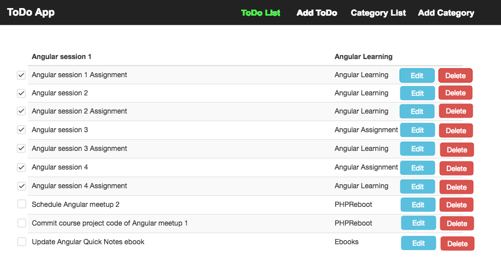
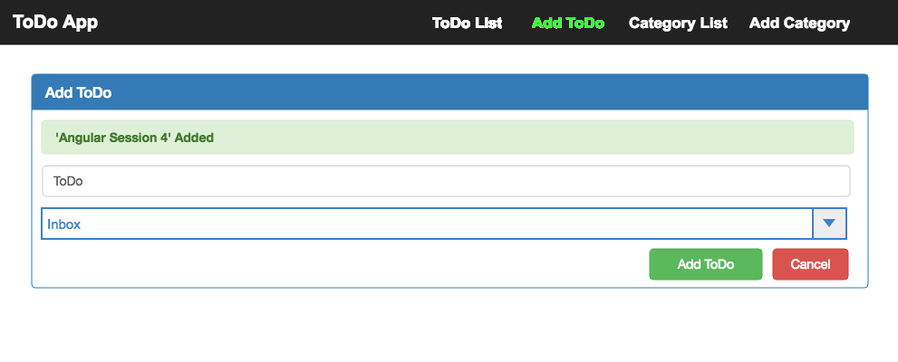
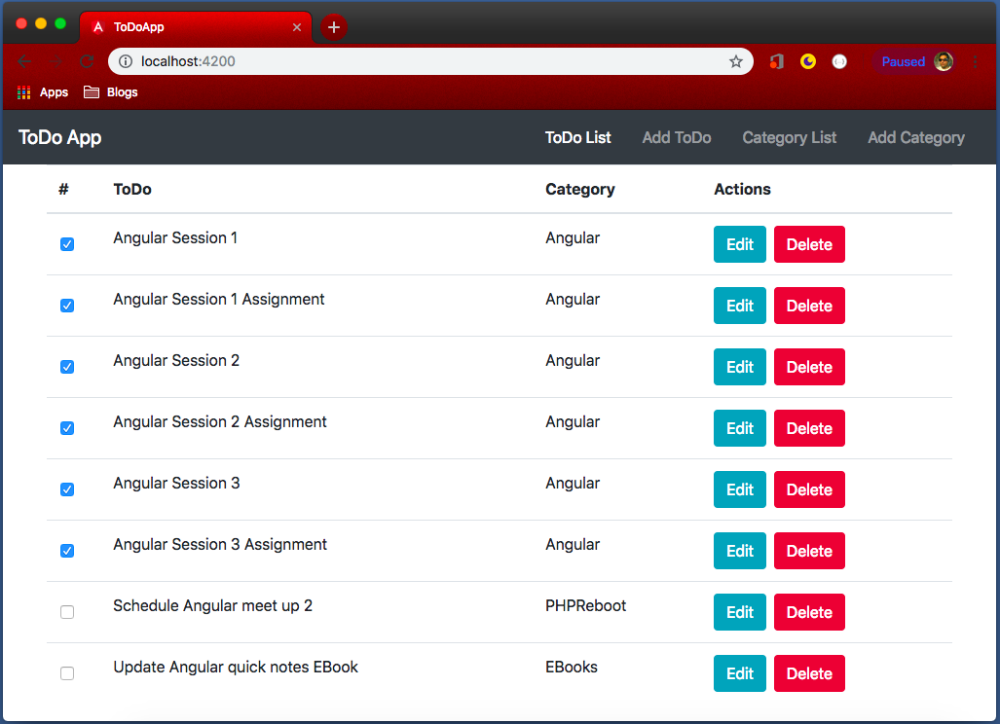

# Course Project

Making a practical application is always helpful while learning some new programming language or a framework. The application we make while learning need not to ba a client project. We can be our own client and think about an application, that we can use. Thus, to maximize our learning, we will be making an application, that we may use in our daily life.

## Getting things done

Have you ever said 'I could not do a thing because I was out of time'? Most of us must have said that; some might say many times a day and others once in a while.

David Allen has written a best seller book named [Getting things done, the art of stress-free productivity](https://gettingthingsdone.com)[^4.1]. In business world, this book is considered as bible of productivity. In India, it can be purchased from [Amazon](https://www.amazon.in/Getting-Things-Done-Stress-free-Productivity/dp/0349410151)[^4.2] or [Flipkart](https://www.flipkart.com/getting-things-done/p/itmf3zrk9cpvyhu4)[^4.3] or other sites or book stores like crossword etc.

However, we need to make an application, for practice and our own use. If you do not want to read whole book, a good summary is given at [Four minute books](https://fourminutebooks.com/getting-things-done-summary/)[^4.4]. Let's discuss a quick summary for our application here as well.

[^4.1]: https://gettingthingsdone.com
[^4.2]: https://www.amazon.in/Getting-Things-Done-Stress-free-Productivity/dp/0349410151
[^4.3]: https://www.flipkart.com/getting-things-done/p/itmf3zrk9cpvyhu4
[^4.4]: https://fourminutebooks.com/getting-things-done-summary/

### Getting things done summary.

1. Capture, Collect what has your attention
    - Use an in-basket, note pad, or voice recorder to capture 100% of everything that has you attention. Little, big, personal and professional--all your to-do's, project, things to handle or finish.
    - For our allpication, we will place all the tasks as 'ToDo' in 'input' category, which is also our default categoty.
2.  Clarify, Process what it mean
    - Take everythingthat you capture and ask: Is it actionable? If no, then trash it, incubate it, of file it as reference. If yes, decide the very next action required. If it will take less than two minutes, do it now. If not, delegate it if you can; or put it on a list to do when you can.
    - This is thinking step so our application will not have it. We can just show all the items in a particular category.
3. Organize, Put it where it belongs
    - Put the action remainders on the right list. For example create lists for the appropriate categories--call to make, errands to run, emails to send etc.
    - In our application, we must provide a way to add/edit/delete categories, which will act as lists.
4. Reflect, Review frequently
    - Look over your listas often as necessaryto determine what to do next. Do a weekly review to clean up, update your lists, and clear your mind.
    - This is again a thinking step. We will provide support to list ToDo based on different criteria like by category, by status, by due date (Not in course project but assignment), etc.
5. Engage, Simply do
   - Use your system to take appropriate actions with confidence.
   - This is action or actually doing the task. Our application can't help there but just to remind to do things.

## ToDo App

We are making out ToDo App to achieve above steps through a web application.

### Home page or ToDo List Page



_Above image is wireframe, actual page might look little different in design._

Out app have a top bar with Text logo on the left and 4 links on the right. Links are:

- ToDo List
    - This is the landing (this) page. Current page must be highlighted in menu as well. We do this by changing color of current page link to green.
- Add ToDo
    - This is the form to add new ToDo list.
- Category List
    - Like ToDo list, this page will show list of available categories.
- Add category
    - This page will contain a form to add new categories.

After Menu bar at top, which is common for all the pages, we have ToDo list on landing page. This page contains a table with 4 columns:

- Checkbox to show done/not done task
- ToDO - Task to be done.
- Category under which task is listed.
- Actions, For now, we have two action for each task, edit and delete. Delete will simply delete the ToDo. Edit will open the task on Add Task page but with fields pre-populated.

### Add ToDo page



Add ToDo page simply contains a form with a text field to enter ToDo, Drop down to select category and 'Add ToDo' and 'Cancel' buttons.

### Category list and Add Category

Category list and add category pages are sililar to ToDo list and Add ToDo pages but they will be dealing with categories. We will completing ToDo pages and category pages will be there as assignment.

## Creating assignment project

We have already seen how to create a new Angular application, how to create components and data binding. Before learning any thing new, let's use these concepts to start building our application.

### Creating ToDo App

Let's create a new project `ToDoApp`, we already know the command:

```bash
ng new ToDoApp
```

This will create a new angular project. Open your project in your favorite editor/IDE. In this course, I'll be using PHP Storm, which is similar to Web Storm, with added support for PHP. PHP Storm is an IDE developed by Jet Brains, who is also sponsor of PHP Reboot community and provide free license of any Jet Brains IDS to be given as swags during meetups. In Corporate training of Angular on October 27th, 2018, two lisense will be raffled out. Web Storm, PHP Storm or most of other Jet Brains IDE have excellent suppoer for Java Script frameworks including Angular.

However, if you need any free alternative, Visual Studio code is supposed to have excellent support for Angular and is favorite editor of many Angular developers. You may also choose any other IDE/Editor, which you feel most confortable with.

## Using Bootstrap

Bootstrap is an open source CSS framework, which makes it very easy to work with CSS. We will be using Bootstrap in our ToDo App but you are free to use any CSS framework or making you own custom CSS from scratch. For ToDo App, we will be using Bootstrap 4, which is recently released and is the latest version of bootstrap.

We will install bootstrap through npm. To do that, run following command

```bash
npm install --save bootstrap@4
```

'npm' will warn about installing JQuery and other JS library. However, We need bootstrap only for CSS, not JQuery, so we can avoid that warning.

> Both Angular and JQuery are JS frameworks and cross each other's way. Thus, even though it is technically possible, we generally avoid using JQuery with Angular.

Any package installed through npm goes in 'node_modules' folder. This folder contains many npm packages, which helps during development so every library available in 'node_modules' is not used in final angular application. We need to specifically tell angular to include bootstrap in our application.

This is where 'angular.json' file at root is useful. In 'angular.json' file, add our bootstrap's css file 'node_modules/bootstrap/dist/css/bootstrap.min.css' under 'styles' array.

~~~ { .json .numberLines startFrom="25"}
"styles": [
    "node_modules/bootstrap/dist/css/bootstrap.min.css",
    "src/styles.css"
],
~~~

Please note, there are multiple 'styles' array in the file. We need to add bootstrap in styles array under 'build'.

With this, now bootstrap css is added in our project, which you can check under page source and start using bootstrap for styling.

## Planning Components

It is always important to plan out our components. We can ideally code every thing on single component but this is obviously not a good idea. Component help us to separate out concerns and write reusable code that can be reused at other places. We will see example of reuse of component in our course project. Let's divide our components as follow:

- AppComponent
    - HeaderComponent
    - ToDoComponent
        - add
        - list
    - CategoryComponent
        - add
        - list

This gives us basic following layout with bootstrap

**app.component.html**

```html
<!-- Header -->
<div class="container">
  <!-- ToDo -->
  <!-- Category -->
</div>
```

Here, commented 'Header', 'Add ToDo', and 'ToDoList' represents selector of respective componente. Let's start filling place holders by creating required components.

## Header component

Let's create now component through Angular CLI.

```bash
ng g c common/Header --no-spec
```

Here, '--no-spec' option tell Angular CLI that we do not want to create spec.ts file. We can start by making our navigation in new component

**app/common/header/header.component.html**

```html
<nav class="navbar navbar-dark bg-dark">
  <a class="navbar-brand" href="#">ToDo App</a>
  <div class="navbar-nav d-flex flex-row">
    <a class="nav-item nav-link active mx-3" href="#">ToDo List</a>
    <a class="nav-item nav-link mx-3" href="#">Add ToDo</a>
    <a class="nav-item nav-link mx-3" href="#">Category List</a>
    <a class="nav-item nav-link mx-3" href="#">Add Category</a>
  </div>
</nav>
```

Now let's load new component in out app component

**app.component.html**

```html
<app-header></app-header>
<div class="container">
  <!-- ToDo -->
  <!-- Category -->
</div>
```

That's all, our header is ready. Only issue, right now, links are not working, but we will soon make them working.

## ToDo Component

Let's create new component ToDoComponent

```bash
ng g c ToDo --no-spec
```

We first need to update app.component.html to include new ToDo component

**app.component.html**

```html
<app-header></app-header>
<div class="container">
  <app-to-do></app-to-do>
  <!-- Category -->
</div>
```

Now, we need to update 'to-do.conponent.ts' to get our data. For now, let us hardcode data in Type Scritp file. As we progress in the course, we will see how to handle data in better way.

**app/to-do/to-do.component.ts**

```typescript
import { Component, OnInit } from '@angular/core';

@Component({
  selector: 'app-to-do',
  templateUrl: './to-do.component.html',
  styleUrls: ['./to-do.component.css']
})
export class ToDoComponent implements OnInit {

  toDos = [
    {
      'name': 'Angular Session 1',
      'done': true,
      'category': 'Angular'
    },
    {
      'name': 'Angular Session 1 Assignment',
      'done': true,
      'category': 'Angular'
    },
    {
      'name': 'Angular Session 2',
      'done': true,
      'category': 'Angular'
    },
    {
      'name': 'Angular Session 2 Assignment',
      'done': true,
      'category': 'Angular'
    },
    {
      'name': 'Angular Session 2',
      'done': true,
      'category': 'Angular'
    },
    {
      'name': 'Angular Session 2 Assignment',
      'done': true,
      'category': 'Angular'
    },
    {
      'name': 'Schedule Angular meetup 2',
      'done': false,
      'category': 'PHPReboot'
    },
    {
      'name': 'Update Angular quick notes ebook',
      'done': false,
      'category': 'ebook'
    }
  ];

  constructor() { }

  ngOnInit() { }

}
```

This is the default TS class generated by CLI, we just added a variable 'toDos' which is a Java Script array of Objects. Please note, Type Script is super set of Java Script thus, JS code mostly works in TS.

**app/to-do/to-do.component.html**

```html
<div class="row">
  <div class="col">
    <table class="table">
      <thead>
        <tr>
          <th scope="col">#</th>
          <th scope="col">ToDo</th>
          <th scope="col">Category</th>
          <th scope="col">Actions</th>
        </tr>
      </thead>
      <tbody>
        <tr *ngFor="let toDo of toDos">
          <td><input type="checkbox" class="form-control" [checked]="toDo.done"></td>
          <td>{{ toDo.name }}</td>
          <td>{{ toDo.category }}</td>
          <td>
            <button class="btn btn-info mr-2">Edit</button>
            <button class="btn btn-danger">Delete</button>
          </td>
        </tr>
      </tbody>
    </table>
  </div>
</div>
```

In HTML file, line 1-12 and 22-25 are simple HTML and Bootstrap. Between line 13-21, we want to print table rows.

Line 13 'tr' is simple HTML element to print table row. However, there is a special code `*ngFor="let toDo of toDos"`. This is called directive. We will discuss more about directives after components. Actually, component is also a directive with template. In short, directives are the instructions in the DOM, just like components instruct angular tochange a 'tag', directives are attributes which instruct angular to change DOM.

Here, we are using '*ngFor' directive, which is used to repeat an element for a given instance of time. It is much like 'foreach' loop of many programming languages. `let toDo of toDos` will take one element of toDos at a time and save is as `toDo`. This will be repeated for every element of the array.

Within 'tr' tag, we have simple 'td' tags and 'toDo' is representing individual JS object within toDos array. Thus, we can use object properties in JS syntax like 'toDo.name', 'toDo.category' etc.

With this code, our application now looks as follow.



## v0.1.0

> Code till here is available in branch `v0.1.0`.
