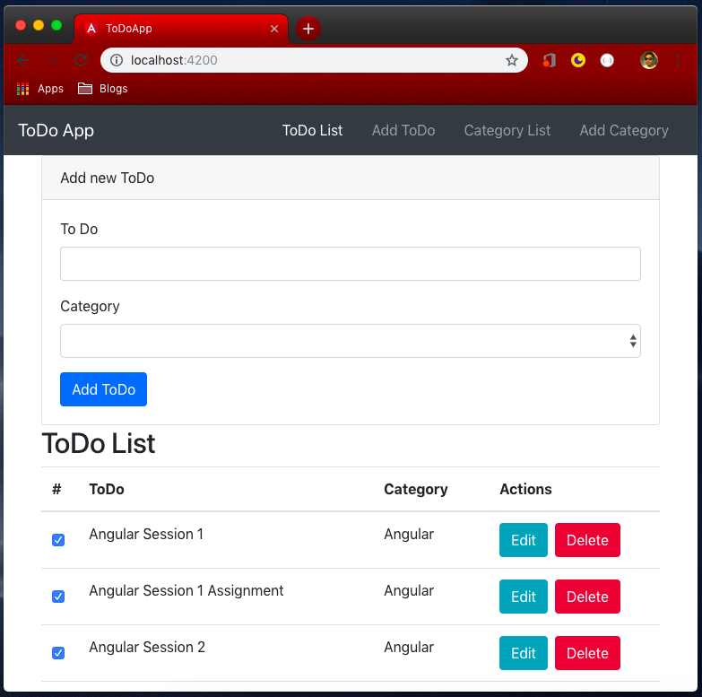

# Components Continued

Now we have our basic course project ready, we can continue working on that while learning new things. We have two goals here:

- Learn and apply new features of angular.
- Learn and apply best practices.

Before we learn a new topic, let's discuss about component structure and make our application better.

## Component structure

Now our application can show hardcoded to-do list. However, we also have categories and both to-do and category have list and create component. As we discussed under 'Planning Components' section of last chapter, we should have components divided as follow:

- AppComponent
    - HeaderComponent
    - ToDoComponent
        - add
        - list
    - CategoryComponent
        - add
        - list

Thus, we should have ListComponent under ToDo component. Let's create a new 'ListComponent'.

```bash
ng generate component to-do/list --no-spec
```

Now, since we need to load our ToDo list from ListComponent, let's move code of 'to-do.component.html' to 'list.component.html'. With this, we now need to load ListComponent in ToDoComponent.

**app/to-do/to-do.component.html**

```html
<app-list></app-list>
```

'to-do.component.html' now have just one line of code. However, if we check our page now, there is no task in our list. Reason is obvious, we are looping on 'toDos' variable but 'list.component.ts' have no such variable.

To make it work again, we need to move 'toDos' variable in ListComponent. However, this is not good. ToDoComponent, as the name suggest, is the right place to keep our 'toDos' array and perform all operations on it. ListComponent, as name suggest, is just responsible to show the list, not manage it.

Thus, we need a way to pass our 'toDos' array from ToDoComponent (parent component) to ListComponent (child component). Time to learn a new feature of Angular.

## Custom Property Binding - Passing data from Parent to Child component.

We already learned about property binding. By property binding, we assign some value to HTML elements.

**What is component?**

If you see the components in angular, we are creating new HTML elements, for example `<app-list>`. Normal HTML elements contain properties like `checked` property in `<input type="checkbox">`. This is meta data to the HTML element, which tell if checkbox is selected or not.

Similarly, on our custom HTML elements (components), we can have some meta-data, which we need to pass through HTML.

> When one component call other component, calling component is the parent component and called component is the child component.

In our ListComponent, we want some data to be passed by parent component (ToDoComponent). This can be done through property binding. However, since we designed ListComponent, it do not have any default property which could be bind. Let's edit our ListComponent to inform angular that we are expecting some data from parent component.

**app/to-do/list/list.component.ts**

```typescript
import {Component, Input, OnInit} from '@angular/core';

@Component({
  selector: 'app-list',
  templateUrl: './list.component.html',
  styleUrls: ['./list.component.css']
})
export class ListComponent implements OnInit {

  @Input() toDos;

  constructor() { }

  ngOnInit() {
  }

}
```

We made two changes. On line 10, we added a variable `toDos`. Important to note, we also added `@Input()` before it. It is another decorator, which tell angular that this variable will be injected and should be available for property binding.

Input class/decorator is defined by Angular, Type Script have no idea about this class. Thus, as second change in the class, we imported `Input` from `@angular/core` in line 1.

Now we are ready to pass `toDos` from ToDoComponent to ListComponent.

**app/to-do/to-do.component.html**

```html
<app-list [toDos]="toDos"></app-list>
```

Here, we added new property binding `[toDos]="toDos"`. It could be confusing due to same variable name in both components. Property `[toDos]` is the variable in child component (list.component.ts) and value `"toDos"` is the variable in parent component (to-do.component.ts).

> Variable names must be defined at class level so above variable names are correct. However, please play with names to understand concept in better way. One way, use property binding as `[toDosInListComponent]="toDosInToDoComponent"`. Now change the name in respective TS classes to keep it working.

> Code till here is committed in branch `v0.1.1`

## Custom event binding - Passing data from child to parent component

In last section, we learned to use custom property binding to pass data from parent to child component. Similarly, we can use custom event binding to pass data from child to parent component.

**What is event?**

In Java Script, we can catch some event happening on a HMTL element. For example, a button element fires 'click' event when clicked.

Similarly, child component can fire some custom event, that parent element may catch. We obviously need to define those events.

### New course project requirement: Adding Create component

Before we understand custom event binding, let's discuss new requirement for our course project. Right now, we are just listing ToDo list. Now we need ability to add new ToDo in the list. For this, we need new CreateComponent. Let's create one.

```bash
ng generate component to-do/create --no-spec
```

In this new form, we want to do two-way binding so first let's add FormsModule in 'app.module.ts'.

**app.module.ts**

```typescript
import { BrowserModule } from '@angular/platform-browser';
import { NgModule } from '@angular/core';
import { FormsModule } from '@angular/forms';

import { AppComponent } from './app.component';
import { HeaderComponent } from './common/header/header.component';
import { ToDoComponent } from './to-do/to-do.component';
import { ListComponent } from './to-do/list/list.component';
import { CreateComponent } from './to-do/create/create.component';

@NgModule({
  declarations: [
    AppComponent,
    HeaderComponent,
    ToDoComponent,
    ListComponent,
    CreateComponent
  ],
  imports: [
    BrowserModule,
    FormsModule
  ],
  providers: [],
  bootstrap: [AppComponent]
})
export class AppModule { }
```

We imported FormsModule in line 3 and added in imports array in line 21.

**app/to-do/create/create.component.html**

```html
<div class="row">
  <div class="col">
    <section class="card card-primary">
      <div class="card-header">
        Add new ToDo
      </div>
      <div class="card-body">
        <div class="form-group">
          <label for="to-do">To Do</label>
          <input type="text" class="form-control" id="to-do" [(ngModel)]="name" />
        </div>
        <div class="form-group">
          <label for="category">Category</label>
          <select class="form-control" id="category" [(ngModel)]="category" >
            <option value="inbox">Inbox</option>
            <option value="angular">Angular</option>
            <option value="phpreboot">PHPReboot</option>
            <option value="ebooks">EBooks</option>
          </select>
        </div>
        <button class="btn btn-primary" (click)="onAddToDo()">Add ToDo</button>
      </div>
    </section>
  </div>
</div>
```

This is a simple form designed using bootstrap 4. It have a text field, a select field and a button. 

> **Please note, we are not using HTML form. Do not wrap our form in `<form>` tag. If you do this, it will not work. Just avoid using `<form>` tag for now, we will learn more about it in 'Forms' chapter.**

First things to notice in our HTML file, we used two-way data binding in line 10 and 14. You can correctly assume we are having variable 'name' and 'category' in our TS class.

Another thing to notice is event binding on button. If you remember event binding, we are calling 'onAddToDo' method. Please note, this is not a custom event but a inbuilt event for a button.

> You can follow any naming convention. In this book, we are are starting any event listener function with `on`. Thus, `onAddToDo` means event for adding ToDo. As a good coding practice, decide any naming conventions with your team and stick to it in whole project.

Now you can probably assume what our TS class should look like.

**app/to-do/create/create.component.ts**

```typescript
import { Component, OnInit } from '@angular/core';

@Component({
  selector: 'app-create',
  templateUrl: './create.component.html',
  styleUrls: ['./create.component.css']
})
export class CreateComponent implements OnInit {

  name: string;
  category: string;

  constructor() { }

  ngOnInit() {
  }

  onAddToDo() {
    console.log(this.name);
    console.log(this.category);
  }
}
```

As expected, we created two variables 'name' and 'category', used for two way binding and a function 'onAddToDo', which is simply logging the variables. If you run project now, it will log the variables when button 'Add ToDo' button is clicked.

However, we wish to sent these variable to parent Component (ToDoComponent) so that it can add it in 'toDos' variable.

### Creating custom event

Before we can fire custom event, we need to create one. Let's do it, obviously in CreateComponent Class.

**app/to-do/create/create.component.ts**

```typescript
import { Component, EventEmitter, OnInit, Output } from '@angular/core';

@Component({
  selector: 'app-create',
  templateUrl: './create.component.html',
  styleUrls: ['./create.component.css']
})
export class CreateComponent implements OnInit {

  name: string;
  category: string;

  @Output() toDoAdded = new EventEmitter<{
    name: string,
    category: string
  }>();

  constructor() { }

  ngOnInit() {
  }

  onAddToDo() {
    this.toDoAdded.emit({
      name: this.name,
      category: this.category
    });
  }
}
```

Custom event need two things

- Create an event (Tell angular about possible event that can be fired)
- Fire (emit) the event whenever required.

We create an event or tell angular about possible event from component with `@Output` decorator. We obviously imported Output class from Angular/core in line 1. Between line 13-16, we are actually creating the event. Any possible event is actually an instance of EventEmitter class, which we also import in line 1.

TypeScript syntax to create EventEmitter (or any other class) is `new EventEmitter()`. However, you may notice a JS object between `<>` before `()`. This is the place where we are telling angular what data to expect in the event. We are telling that out event object will contain two properties; name and category and both will be of type string (TS data type).

Once we defined possible event, we can actually fire (emit) the event. We are doing it in 'onAddToDo' method. We do this by calling `emit` method of EventEmitter and obviously need to pass a JS object containing data we promised while creating EventEmitter object.

### Catching custom event

Once a custom event is fired, binding to it is similar to event binding.

**app/to-do/to-do.component.html**

```html
<app-create (toDoAdded)="onToDoAdded($event)"></app-create>
<app-list [toDos]="toDos"></app-list>
```

We added `(toDoAdded)="onToDoAdded($event)"` which is just event binding, only difference, 'toDoAdded' is not a builtin event but we created it. On this event, we added 'onToDoAdded' function of TS file.

**app/to-do/to-do.component.ts**

~~~ { .typescript .numberLines startFrom="53"}
  onToDoAdded(toDo: {
    name: string,
    category: string
  }) {
    this.toDos.push({
      name: toDo.name,
      done: false,
      category: toDo.category
    });
  }
~~~

At line 53, add above code in to-do.component.ts file. We knew what data our event contains. Thus, as parameter, we told angular that variable toDo is a JS object which contains name and category property.

On line 57, we simply use Java Script Array's push method to add new data to the existing toDos array.

> Since the same array is passed to ListComponent, our list will be automatically updated.

> Code till here is committed in branch `v0.1.2`

## Passing HMTL to child component - ng-content

Any HTML between component selectors are ignored by Angular. This is obvious as we design contents of our component tags with-in component's HTML file. There is no way angular might know where to place HTML with-in component tags.

However, if needed, we can tell angular where to render HTML with-in component tags. We can do this with 'ng-content' tag.

Let's assume heading of our 'Create' and 'List' component is dynamic, which should be rendered by parent component (ToDoComponent). Thus, we first need to define required HTML in selector within 'to-do.component.html'

**app/to-do/to-do.component.html**

```html
<app-create (toDoAdded)="onToDoAdded($event)">Add new ToDo</app-create>
<app-list [toDos]="toDos">ToDo List</app-list>
```

We defined title of component within component tags. However, it will not take effect. For this to take effect, we need to update html file of respective components.

**app/to-do/create/create.component.html**

```html
<div class="row">
  <div class="col">
    <section class="card card-primary">
      <div class="card-header">
        <ng-content></ng-content>
      </div>
      <div class="card-body">
        <div class="form-group">
          <label for="to-do">To Do</label>
          <input type="text" class="form-control" id="to-do" [(ngModel)]="name" />
        </div>
        <div class="form-group">
          <label for="category">Category</label>
          <select class="form-control" id="category" [(ngModel)]="category" >
            <option value="inbox">Inbox</option>
            <option value="angular">Angular</option>
            <option value="phpreboot">PHPReboot</option>
            <option value="ebooks">EBooks</option>
          </select>
        </div>
        <button class="btn btn-primary" (click)="onAddToDo()">Add ToDo</button>
      </div>
    </section>
  </div>
</div>
```

Note, in line 5, where we want to display HTML with component's selector, we added 'ng-content' tag. Let's do the same for list component.

**app/to-do/list/list.component.html**

```html
<div class="row">
  <div class="col">
    <h2>
      <ng-content></ng-content>
    </h2>
    <table class="table">
      <thead>
      <tr>
        <th scope="col">#</th>
        <th scope="col">ToDo</th>
        <th scope="col">Category</th>
        <th scope="col">Actions</th>
      </tr>
      </thead>
      <tbody>
      <tr *ngFor="let toDo of toDos">
        <td><input type="checkbox" class="form-control" [checked]="toDo.done"></td>
        <td>{{ toDo.name }}</td>
        <td>{{ toDo.category }}</td>
        <td>
          <button class="btn btn-info mr-2">Edit</button>
          <button class="btn btn-danger">Delete</button>
        </td>
      </tr>
      </tbody>
    </table>
  </div>
</div>
```

Since out list was not having title earlier, we added line 3-5 to add new header and the HTML of component's selector. Our application now looks as follow



> Code till here is committed in branch `v0.1.3`

## Local Reference

In our create.component.html file, we used two-way binging for name and category variables. We do not want our HTML to be edited from typescript but just to read value of our inout in TS file. Thus, two way binding is not correct here.

We just want variable in one way; from HTML to Type Script. In Data binding section, we learned HTML->TS flow happens through event binding, that we are already doing. However, we are not sending data from HTML->TS through event binding but through two way binding. We can actually do this using Local reference. Let's first check the code.

**app/to-do/create/create.component.html**

```html
<div class="row">
  <div class="col">
    <section class="card card-primary">
      <div class="card-header">
        <ng-content></ng-content>
      </div>
      <div class="card-body">
        <div class="form-group">
          <label for="to-do">To Do</label>
          <input type="text" class="form-control" id="to-do" #name />
        </div>
        <div class="form-group">
          <label for="category">Category</label>
          <select class="form-control" id="category" #category >
            <option value="inbox">Inbox</option>
            <option value="angular">Angular</option>
            <option value="phpreboot">PHPReboot</option>
            <option value="ebooks">EBooks</option>
          </select>
        </div>
        <button class="btn btn-primary" (click)="onAddToDo(name, category)">Add ToDo</button>
      </div>
    </section>
  </div>
</div>
```

Now we removed two way binding from line 10 and 14. We actually replaced them with '#name' and '#category' respectively. We actually assigned them a name or `Local Reference`.

Local Reference is a name given to some element, that we can later use in same file. We are using this local reference in line 21 `(click)="onAddToDo(name, category)"`, where we are passing values as parameters of event. We obviously need to update our TS file to accept these new parameters.

**app/to-do/create/create.component.ts**

```typescript
import { Component, EventEmitter, OnInit, Output } from '@angular/core';

@Component({
  selector: 'app-create',
  templateUrl: './create.component.html',
  styleUrls: ['./create.component.css']
})
export class CreateComponent implements OnInit {

  @Output() toDoAdded = new EventEmitter<{
    name: string,
    category: string
  }>();

  constructor() { }

  ngOnInit() {
  }

  onAddToDo(name: HTMLInputElement, category: HTMLSelectElement) {
    this.toDoAdded.emit({
      name: (<HTMLInputElement>name).value,
      category: (<HTMLSelectElement>category).value
    });
  }
}
```

we removed class variables 'name' and 'category' and updated onAddToDo function on line 20. Worried how to identify parameter type as HTMLInputElement and HTMLSelectElement? Just go back to Event Binding section again to revise how can we identify them, is case we do not remember them.

> Code till here is committed in branch `v0.1.4`

### Local reference in Type Script file

We saw how to use Local Reference in HTML file. We can also use Local Reference in Type Script. Let's check the example.

**app/to-do/create/create.component.ts**

```typescript
import {Component, ElementRef, EventEmitter, OnInit, Output, ViewChild} from '@angular/core';

@Component({
  selector: 'app-create',
  templateUrl: './create.component.html',
  styleUrls: ['./create.component.css']
})
export class CreateComponent implements OnInit {
  @ViewChild('name') nameInTS: ElementRef;
  @ViewChild('category') categoryInTS: ElementRef;

  @Output() toDoAdded = new EventEmitter<{
    name: string,
    category: string
  }>();

  constructor() { }

  ngOnInit() {
  }

  onAddToDo() {
    this.toDoAdded.emit({
      name: (<HTMLInputElement>this.nameInTS.nativeElement).value,
      category: (<HTMLInputElement>this.categoryInTS.nativeElement).value
    });
  }
}
```

We first need to create two variables to hold the value of local reference. We did this in line 9 and 10. The syntax starts with `@ViewChild('nameOfLocalReferenceInHTMLFile')`. It tells angular we want to assign local reference to current variable of TS file. After that we declare variable. These variables are always are of type 'ElementRef', however, you can confirm or identify it with trick we discussed during event binding.

Since we are using ViewChild and ElementRef, we obviously imported them in line 1.

In our onAddToDo function, we no longer needs parameters so we removed them from here and in HTML file as well. However, with this, we needed to change the way of assigning value.

We moved away from two way binding to local reference to remove local variable and now we added them again. However, now they are only one way binding (HTML->TS) and we can not change them in HTML accidentally. Thus, angular provide us different tools to be used in different situations, which tool to use depends on actual project condition.

> Code till here is committed in branch `v0.1.5`
